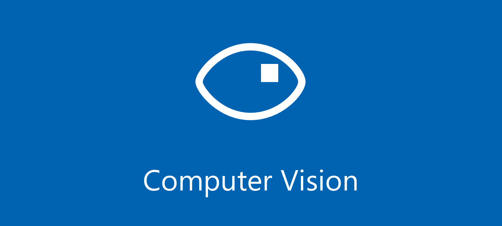

# AutoML for Images Python notebook templates for Azure ML SDK v2

## Content
AutoML is an Azure Machine Learning feature, that empowers both professional and citizen data scientists to build machine learning models rapidly. Since its launch, AutoML has helped accelerate model building for essential machine learning tasks like Classification, Regression and Time-series Forecasting.

There is as well some Computer Vision algorithms available with AutoML for Images.

You can find here some Python notebooks templates you can use for your computer vision projects with Azure ML:

- Image Classification 
<a href="https://github.com/retkowsky/azure_automl_for_images_python_sdk_v2/blob/main/Azure%20AutoML%20for%20Images%20-%20Flowers%20Classification%20-%20SDK%20v2.ipynb">Image classification demo notebook</a>

- Object Detection 
<a href="https://github.com/retkowsky/azure_automl_for_images_python_sdk_v2/blob/main/AutoML%20for%20Images%20-%20Mask%20Object%20Detection%20-%20Downloading%20images%20and%20labels.ipynb">Object detection demo notebook (part 1)</a> 
<a href="https://github.com/retkowsky/azure_automl_for_images_python_sdk_v2/blob/main/AutoML%20for%20Images%20-%20Mask%20Object%20Detection%20-%20AzureML%20sdkV2.ipynb">Object detection demo notebook (part 2)</a>

- Instance Segmentation 
<a href="https://github.com/retkowsky/azure_automl_for_images_python_sdk_v2/blob/main/AutoML%20for%20Images%20-%20Instance%20Segmentation.ipynb">Instance segmentation demo notebook</a>

- Calling deployed model as an Azure ML endpoint 
<a href="https://github.com/retkowsky/azure_automl_for_images_python_sdk_v2/blob/main/Calling%20Azure%20ML%20managed%20endpoint.ipynb">Instanced segmentation model (version 1 with connection to the Azure ML workspace)</a> 
<a href="https://github.com/retkowsky/azure_automl_for_images_python_sdk_v2/blob/main/Calling%20the%20Instance%20Segmentation%20deployed%20model.ipynb">Instanced segmentation model (version 2 with no connection to the Azure ML workspace)</a>

## Documentation
- What is AutoML for Images? https://docs.microsoft.com/en-us/azure/machine-learning/concept-automated-ml#computer-vision-preview
- Algorithms https://docs.microsoft.com/en-us/azure/machine-learning/how-to-auto-train-image-models#supported-model-algorithms
- Tutorials https://learn.microsoft.com/en-us/azure/machine-learning/tutorial-auto-train-image-models?tabs=cli
- ONNX https://docs.microsoft.com/en-us/azure/machine-learning/how-to-inference-onnx-automl-image-models?tabs=multi-class
- How to use AutoML for Images? https://docs.microsoft.com/en-us/azure/machine-learning/how-to-use-automl-small-object-detect https://learn.microsoft.com/en-us/azure/machine-learning/how-to-auto-train-image-models?tabs=cli
- About Azure ML https://azure.microsoft.com/en-us/services/machine-learning/

10-Feb-2023
Serge Retkowsky | serge.retkowsky@microsoft.com | https://www.linkedin.com/in/serger/
